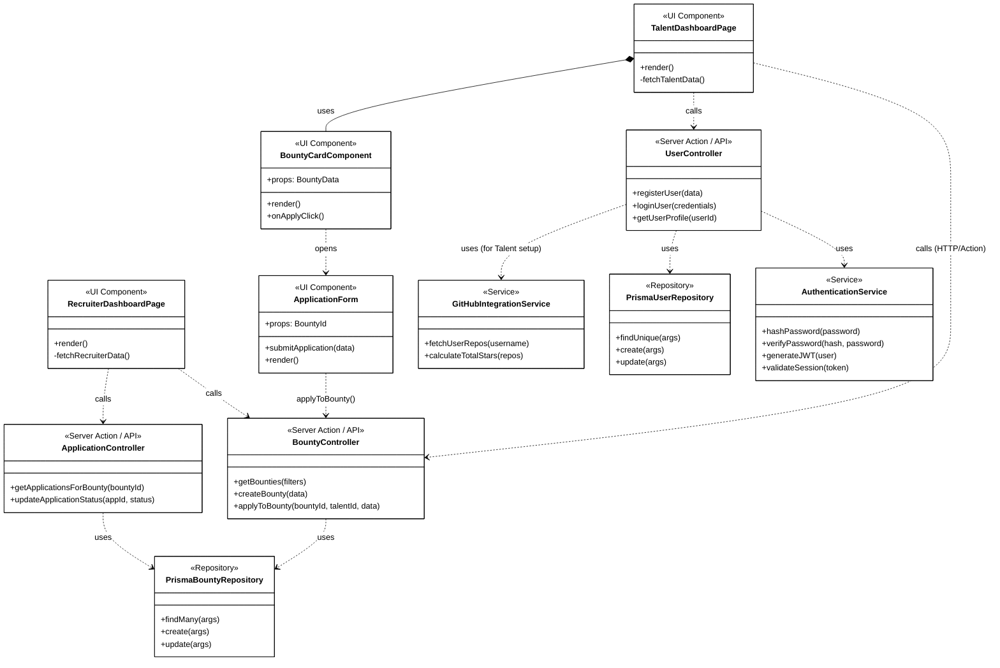

# SkillSpill Design Class Diagram

This document presents the Design Class Diagram for the SkillSpill platform. Unlike the conceptual UML Class Diagram that focuses on database entities, this Design Class Diagram illustrates the actual software components, including Next.js Pages (UI), Server Actions/API Controllers, Services, and Data Access (Prisma), representing the full-stack architecture.

## Diagram (Mermaid)

## Layer Descriptions

### 1. UI Layer (Next.js React Components)
* **Pages (`TalentDashboardPage`, `RecruiterDashboardPage`):** The main views that users interact with. They fetch initial data and render child components.
* **Components (`BountyCardComponent`, `ApplicationForm`):** Reusable UI elements that handle specific user interactions (like clicking "Apply" and filling out forms).

### 2. Application Layer (Next.js Server Actions / API Routes)
* **Controllers (`BountyController`, `UserController`, `ApplicationController`):** These act as the boundary between the frontend and the database. They validate incoming requests, check authorizations, and coordinate business logic.

### 3. Service Layer
* **Services (`AuthenticationService`, `GitHubIntegrationService`):** Encapsulates complex or external business logic, such as integrating with the GitHub API for talent verification, or securely hashing passwords.

### 4. Data Access Layer
* **Repositories / ORM (`PrismaUserRepository`, `PrismaBountyRepository`):** Represents the Prisma Client abstraction. These execute direct queries (create, read, update, delete) against the MySQL database.
