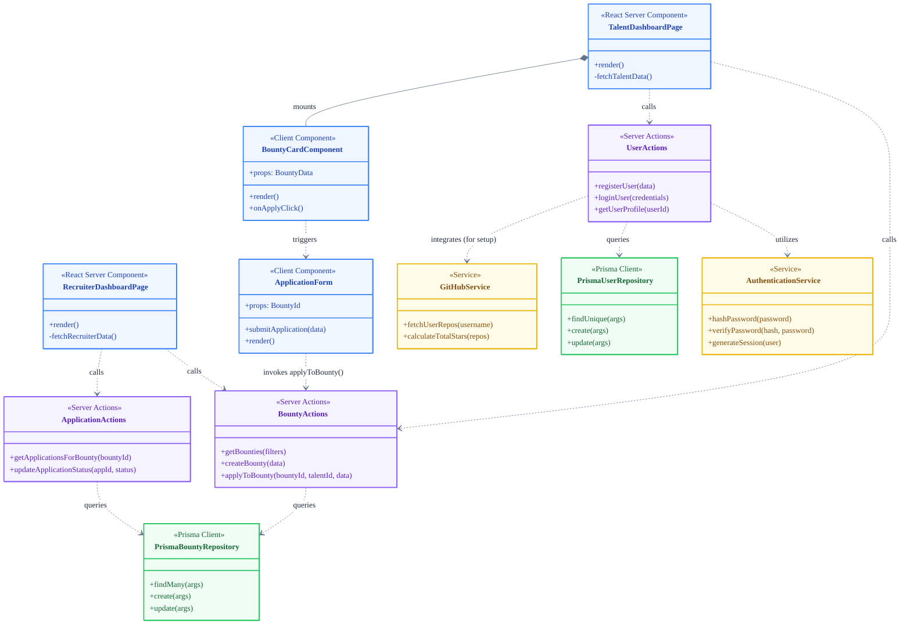

# SkillSpill Design Class Diagram

This document presents the **Design Class Diagram** for the SkillSpill platform. Unlike the conceptual Domain Model, this diagram illustrates the actual software components representing the full-stack architecture. It has been customized to accurately reflect the **Next.js (App Router)** and **Prisma** architecture.

## Diagram (Mermaid)

## Layer Descriptions

### 1. UI Layer (Next.js React Components) - Blue
* **Pages (`TalentDashboardPage`, `RecruiterDashboardPage`):** The React Server Components (RSC) that users interact with. They fetch initial data securely on the server and render child components.
* **Components (`BountyCardComponent`, `ApplicationForm`):** Reusable Client Components that handle interactivity and UI states (like clicking "Apply" and managing form inputs).

### 2. Application Layer (Next.js Server Actions) - Purple
* **Actions (`BountyActions`, `UserActions`, `ApplicationActions`):** These act as the boundary between the frontend and the database in Next.js App Router. They validate incoming requests, check authorizations, mutate data, and coordinate business logic.

### 3. Service Layer - Yellow
* **Services (`AuthenticationService`, `GitHubService`):** Encapsulates complex or external business logic, such as integrating with the GitHub API for talent verification, or securely hashing passwords using `bcrypt`.

### 4. Data Access Layer (Prisma) - Green
* **Repositories (`PrismaUserRepository`, `PrismaBountyRepository`):** Represents the generated Prisma Client abstraction. These execute direct database queries against the MySQL schema safely and with full TypeScript typing.
