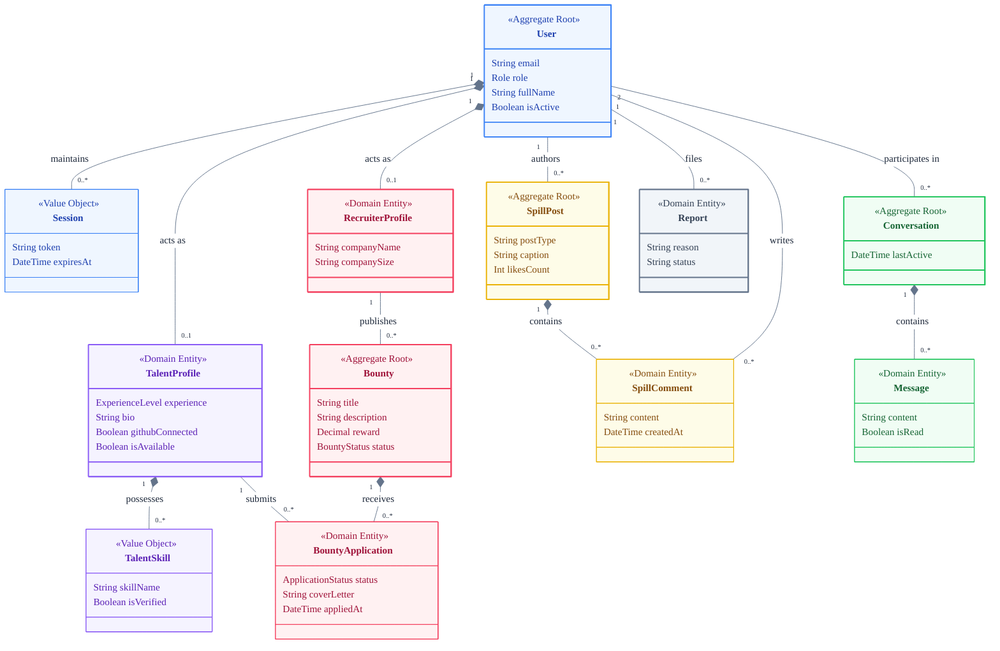

# SkillSpill Domain Model Diagram

This document presents the high-level Domain Model Diagram for the SkillSpill platform. Unlike a strict database schema or a technical UML diagram, this focuses on the core business domains, their primary attributes, and how they relate conceptually to each other.

## Diagram (Mermaid)

## Domain Explanations

1. **Identity Domain (Blue)**: Represents the core user authentication and session management. `User` is the central aggregate root that ties everything together.
2. **Talent Domain (Purple)**: Represents the candidate side of the platform, tracking skills, experience, and availability.
3. **Recruiter & Job Domain (Pink)**: Tracks the employers (`RecruiterProfile`) and the jobs/challenges they post (`Bounty`). It also handles the link between a Talent and a Job (`BountyApplication`).
4. **Social Domain (Yellow)**: Encompasses the "Spill" feed, allowing users to create posts and comment on them.
5. **Comms Domain (Green)**: Handles private direct messaging between users.
6. **Support Domain (Gray)**: Handles moderation elements like reports and appeals.
