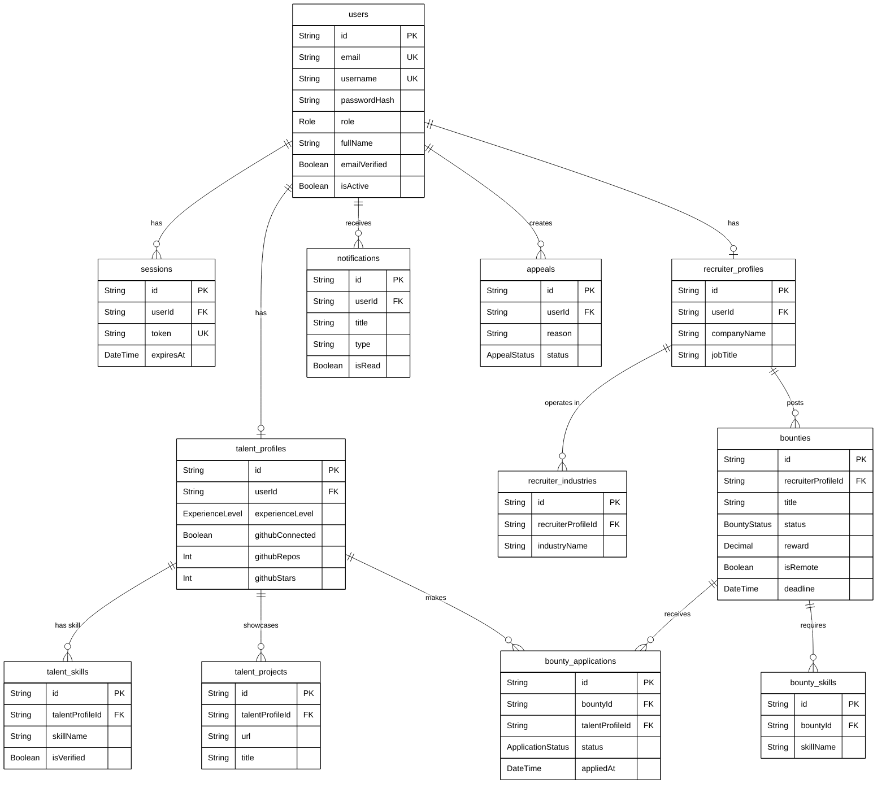

# SkillSpill Entity-Relationship (ER) Diagram

This document presents the Entity-Relationship (ER) Diagram based on the SkillSpill Prisma database model. It describes the entities in the database and their relational links.

## Diagram (Mermaid)

