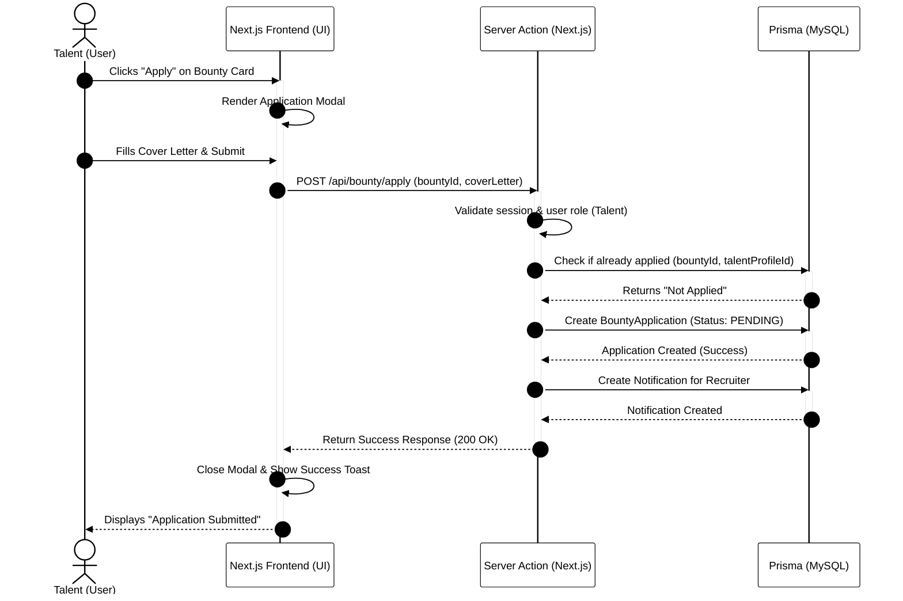
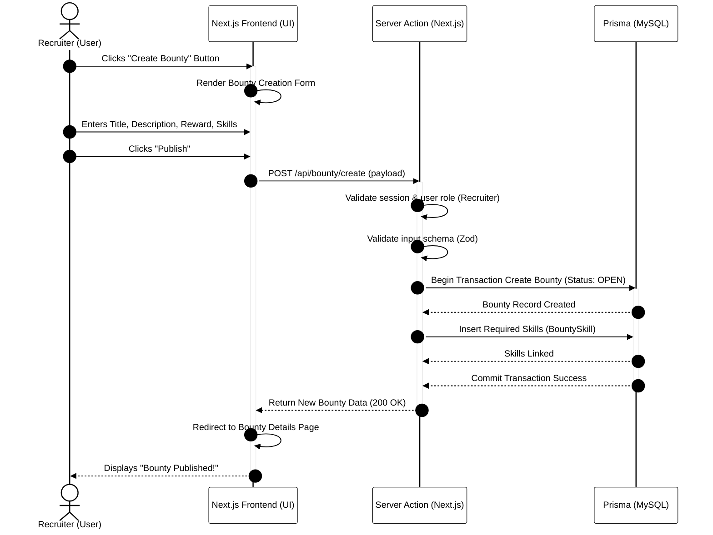
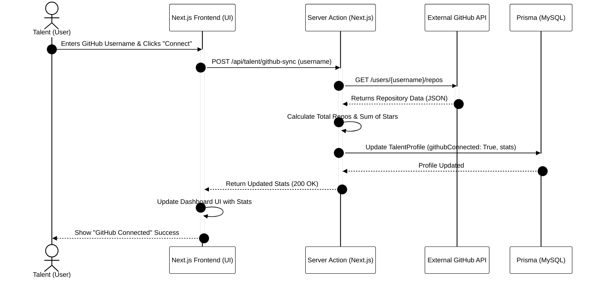

# SkillSpill Sequence Diagrams

This document contains Sequence Diagrams for the core interactions within the SkillSpill platform, demonstrating the step-by-step communication between the User, Frontend UI, Backend Web Server (Next.js Application), and the Database.

## 1. Talent Applies for a Bounty

This diagram illustrates the process when a Talent user discovers a Bounty and successfully submits an application.

## 2. Recruiter Posts a New Bounty

This diagram shows the sequence when a Recruiter publishes a new job/bounty to the platform.

## 3. GitHub Profile Integration (Talent)

This sequence shows how the system fetches and verifies external data to update a Talent's profile.

