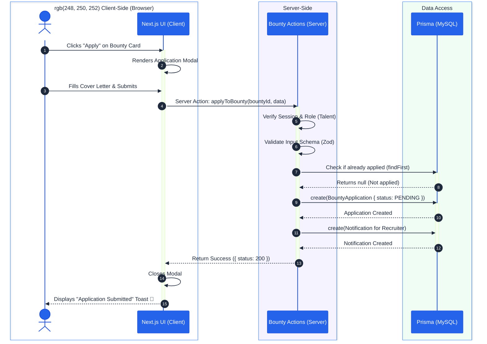
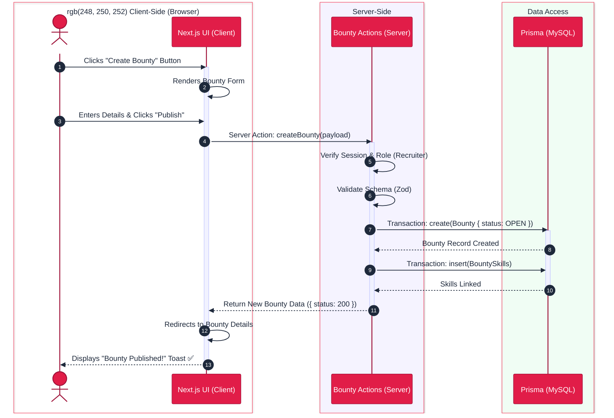
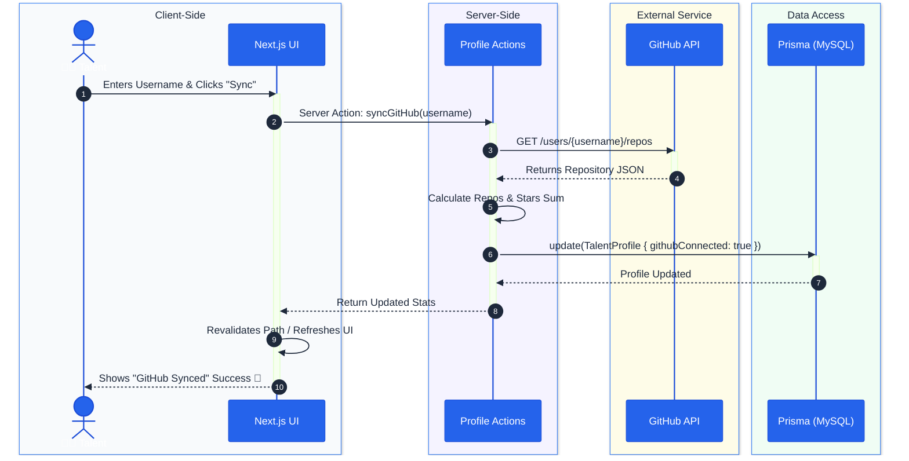
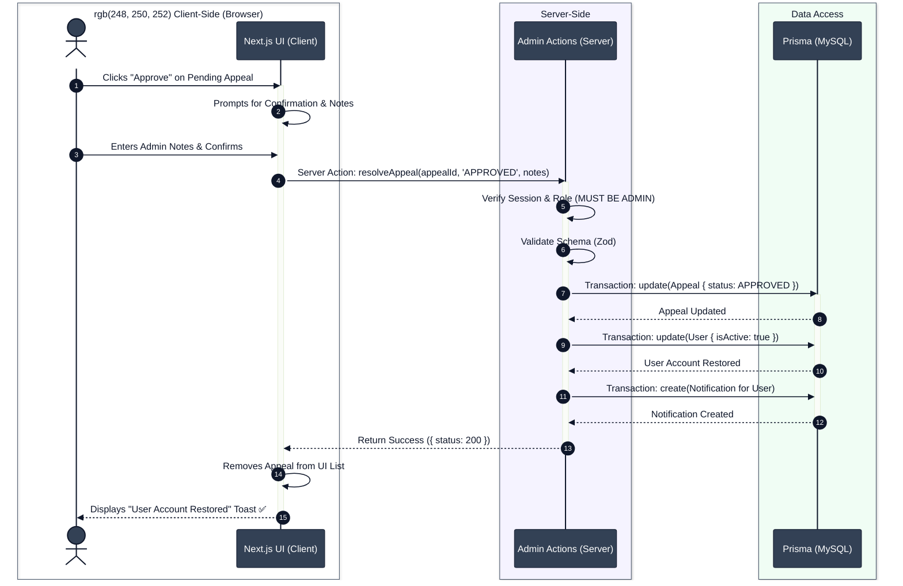

# SkillSpill Sequence Diagrams

This document contains beautifully designed Sequence Diagrams for the core interactions within the SkillSpill platform, demonstrating the step-by-step communication between the User, Client-Side (React UI), Server-Side (Next.js Actions), and Database (Prisma).

## 1. Talent Applies for a Bounty

This diagram illustrates the process when a Talent user discovers a Bounty and successfully submits an application.

## 2. Recruiter Posts a New Bounty

This diagram shows the sequence when a Recruiter publishes a new job/bounty to the platform.

## 3. GitHub Profile Integration (Talent)

This sequence shows how the system fetches and verifies external data to update a Talent's profile.

## 4. Admin Reviews a Suspension Appeal

This diagram outlines the process when an Administrator reviews an appeal submitted by a suspended user and decides to restore their account.

