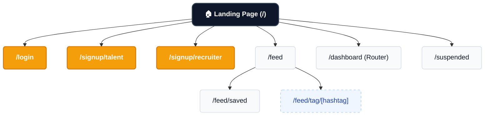
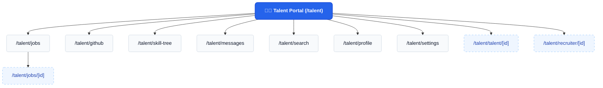
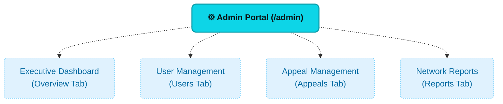

# SkillSpill Navigation Maps (Separate Portals)

Below are the separate navigation maps for Authentication/Public, Talent, Recruiter, and Admin dashboards.

## 1. Authentication & Public Navigation

## 2. Talent Portal Navigation

## 3. Recruiter Portal Navigation

```mermaid
graph TD
    classDef portalNode fill:#7B2FFF,stroke:#5A18C8,stroke-width:2px,color:#FFFFFF,font-weight:bold,rx:8,ry:8;
    classDef pageNode fill:#f8fafc,stroke:#cbd5e1,stroke-width:1px,color:#0f172a,rx:5,ry:5;
    classDef dynamicNode fill:#f3e8ff,stroke:#d8b4fe,stroke-width:1px,color:#6b21a8,stroke-dasharray: 5 5,rx:5,ry:5;

    Recruiter["🏢 Recruiter Portal (/recruiter)"]:::portalNode

    R_Jobs["/recruiter/jobs"]:::pageNode
    R_Apps["/recruiter/applications"]:::pageNode
    R_Messages["/recruiter/messages"]:::pageNode
    R_Notifs["/recruiter/notifications"]:::pageNode
    R_Search["/recruiter/search"]:::pageNode
    R_Profile["/recruiter/profile"]:::pageNode
    R_Settings["/recruiter/settings"]:::pageNode
    R_ViewT["/recruiter/talent/[id]"]:::dynamicNode
    R_ViewR["/recruiter/recruiter/[id]"]:::dynamicNode

    Recruiter --> R_Jobs
    Recruiter --> R_Apps
    Recruiter --> R_Messages
    Recruiter --> R_Notifs
    Recruiter --> R_Search
    Recruiter --> R_Profile
    Recruiter --> R_Settings
    Recruiter --> R_ViewT
    Recruiter --> R_ViewR
```

## 4. Admin Portal Navigation

*Note: The Admin portal is built as a single-page application using internal React state to switch tabs, so the paths are represented as internal sections rather than router URLs.*

