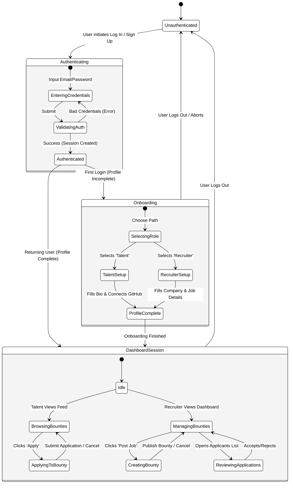

# SkillSpill State Chart Diagram

This document contains a comprehensive State Chart Diagram (also known as a State Machine Diagram) but focused on the broader system behavior, specifically the **User Journey and Session Lifecycle**.

While the earlier `State-Machine-Diagram.md` focused on individual record entities (like a single Bounty or Application), this State Chart Diagram illustrates the complex, composite states a User traverses when interacting with the application.

## 1. User Journey & Session State Chart

This diagram illustrates the login, onboarding, and dashboard interactions for both Talent and Recruiter users, showing hierarchical states.

### State Chart Explanations

1. **Unauthenticated / Authenticating:** The user starts here. An internal sub-state machine validates their credentials against the Prisma database. If authentication fails, they are returned to the input state; if it succeeds, they become `Authenticated`.
2. **Onboarding:** A critical fork in the state. If the Prisma user record lacks a related `TalentProfile` or `RecruiterProfile`, they must pass through this state. It splits into two mutually exclusive sub-states (`TalentSetup` and `RecruiterSetup`) before converging at `ProfileComplete`.
3. **DashboardSession:** Once inside, the user enters an `Idle` state on their dashboard. From here, depending on their role, they branch into different activity states:
    *   **Talent:** Transition into `BrowsingBounties` and `ApplyingToBounty`.
    *   **Recruiter:** Transition into `ManagingBounties`, `CreatingBounty`, and `ReviewingApplications`.
4. **Logout:** From any active, authenticated major state (Dashboard or Onboarding), triggering a Log Out action transitions the user immediately back to the initial `Unauthenticated` state, terminating the session.
