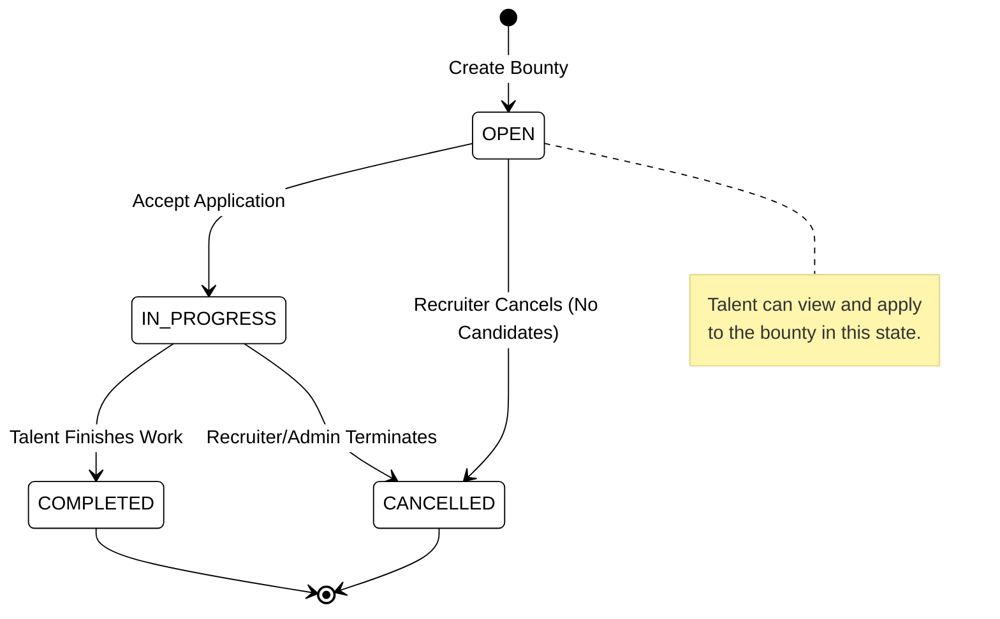
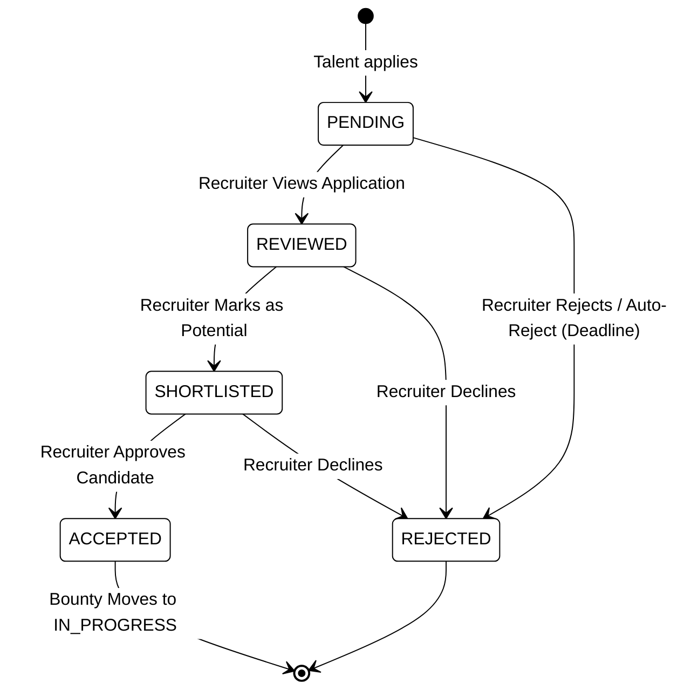
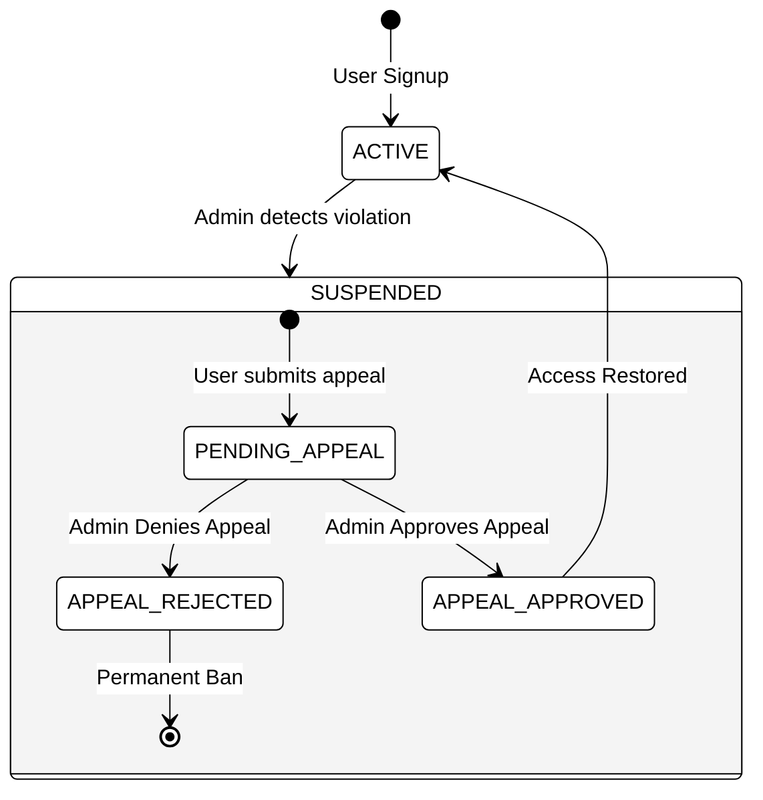

# SkillSpill Architecture - State Machine Diagrams

This document contains State Machine diagrams to illustrate the lifecycle of key entities in the SkillSpill system: **Bounty** (Job Post) and **Application** (Candidate Submission).

## 1. Bounty State Machine

This diagram shows how a Bounty transitions through different states from its creation by a recruiter to its completion or cancellation.

## 2. Bounty Application State Machine

This diagram outlines how a Talent's application to a particular Bounty moves from submission to the final decision.

## 3. User Suspension / Appeal State Machine

To show the lifecycle of an Admin moderating a user.

