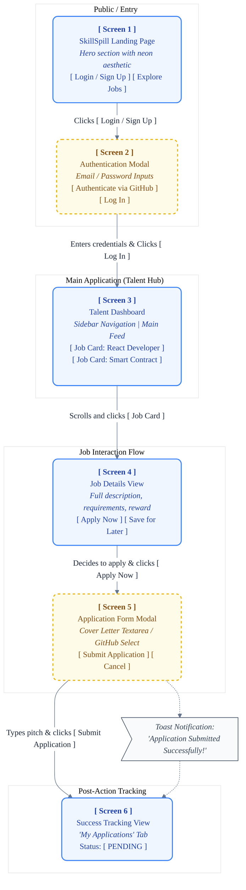

# SkillSpill Storyboard Diagram (User Flow)

This document presents a UI Storyboard (User Flow) Diagram for the SkillSpill platform. 

A storyboard diagram visually represents the sequence of graphical User Interface (UI) screens a user navigates through to accomplish a specific goal. This specific storyboard illustrates the **Talent User Journey**: from arriving at the site to successfully applying for a Job.

## Storyboard Flowchart

## Screen Descriptions

1.  **Screen 1 - Landing Page:** The initial impression of the SkillSpill platform. It features the primary brand messaging, futuristic glassmorphism design, and clear call-to-actions to funnel users into the onboarding process.
2.  **Screen 2 - Authentication Modal:** A popup overlay where users can create an account or log in. It includes options for traditional email/password login as well as rapid OAuth login (like GitHub), which is highly relevant for the Talent user base.
3.  **Screen 3 - Talent Dashboard:** The core hub for authenticated Talent. The UI displays an endless feed or grid of available Jobs. Each card provides a high-level summary (Title, Reward, Tech Stack).
4.  **Screen 4 - Job Details View:** Once a Job Card is clicked, the UI expands to show a dedicated page or full-screen modal. The user can read the complete requirements and evaluate the specific criteria before deciding to apply.
5.  **Screen 5 - Application Form Modal:** An active input state overlay. The Talent writes their cover letter/pitch here. The UI might optionally autofill their verified tools or GitHub links to streamline the application process.
6.  **Screen 6 - Success Tracking View:** Post-submission, the user is redirected to a dashboard tab (e.g., "My Applications") where they can visually track the timeline of their submission moving from "PENDING" to "ACCEPTED" via status badges.
