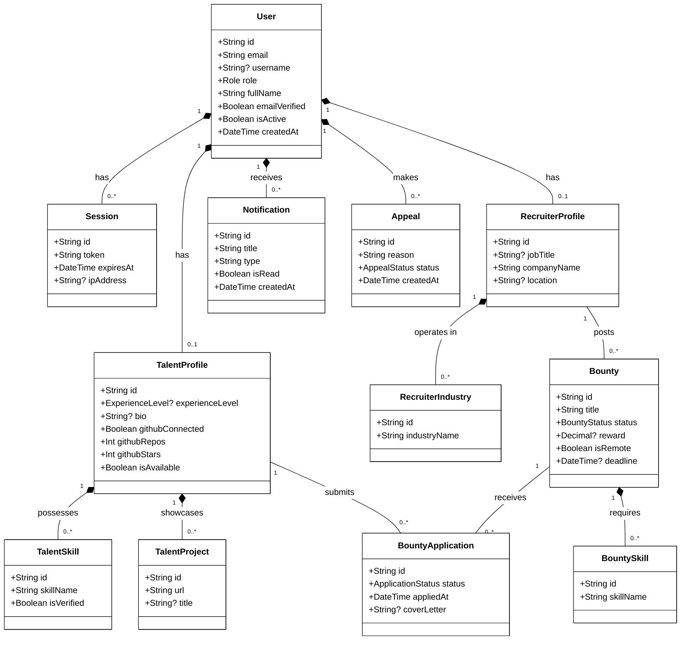

# SkillSpill UML Class Diagram

This document presents the UML Class Diagram for the SkillSpill platform, outlining the core entities, their attributes, and their architectural relationships in a clean format to match the project aesthetics.

## Diagram (Mermaid)

## Entity Descriptions

### 1. Core Authentication & Users
* **User:** The central entity that handles authentication and base authorization (Talent, Recruiter, Admin). It links to every notification, session, or specific profile.
* **Session:** Handles tracking logged-in states globally. 

### 2. Talent Entities
* **TalentProfile:** Holds specific properties for users acting as developers and candidates (e.g., GitHub stats, experience level, availability).
* **TalentSkill:** Links specific granular skills verified onto the talent's profile.
* **TalentProject:** Showcases the talent's past portfolio projects.

### 3. Recruiter Entities
* **RecruiterProfile:** Holds employer-level properties for users who create job postings (Bounties).
* **RecruiterIndustry:** Represents sectors or fields that the recruiter operates within.

### 4. Bounties (Jobs)
* **Bounty:** Represents job postings, issues, or projects posted by recruiters. Tracks statuses such as OPEN or COMPLETED.
* **BountySkill:** The required skills specified by a recruiter for a particular Bounty.
* **BountyApplication:** The junction entity linking a Talent to a Bounty, retaining cover letters, statuses (PENDING, ACCEPTED), and timestamps.

### 5. Administration
* **Notification:** Direct system notices sent to users.
* **Appeal:** Security/Banning mechanism handling system appeals for suspensions.
