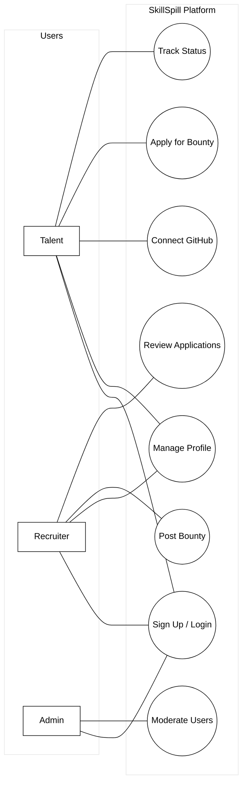

# SkillSpill Use Case Diagram

This document presents a professional, minimalist use case diagram for the SkillSpill platform. It identifies the actors and their key interactions in a clean black-and-white format.

## Diagram (Mermaid)

## Detailed Use Case Descriptions

### 1. Authentication & Onboarding
*   **Sign Up / Log In**: Users can create an account as either Talent or Recruiter or log in using existing credentials.
*   **Verify Email**: A security step to ensure the validity of the user's email address.

### 2. Talent Functionalities
*   **Manage Talent Profile**: Updating biography, experience level, portfolio links, and resume.
*   **Connect GitHub**: Integration to fetch repositories and star counts to prove technical proficiency.
*   **View Skill Tree**: Visualize verified skills and progress within the platform.
*   **Search & View Bounties**: Browse available "bounties" (job/project listings) with neon-themed UI.
*   **Apply for Bounty**: Submit application details and cover letters for specific opportunities.
*   **Track Application Status**: Monitor if an application is Pending, Reviewed, Shortlisted, Rejected, or Accepted.

### 3. Recruiter Functionalities
*   **Manage Recruiter Profile**: Setting up company name, size, website, and industry.
*   **Create Bounty**: Posting new work opportunities with requirements, rewards, and deadlines.
*   **Manage Bounties**: Editing active bounties or changing their status (Open, Completed, etc.).
*   **Review Applications**: Processing submissions from Talent, including shortlisting or rejecting candidates.
*   **Search Talent Profiles**: Proactively looking for potential candidates based on skills and experience.

### 4. Administrative & Shared Functionalities
*   **Moderate Users**: Admins can suspend users who violate platform policies.
*   **Review Appeals**: Handling requests from suspended users to regain access.
*   **View Notifications**: Real-time alerts for application updates, new bounties, or system messages.
*   **Appeal Suspension**: Standard process for any user to contest a platform-wide action.
