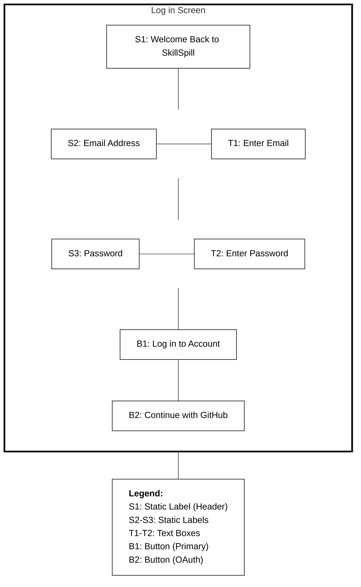
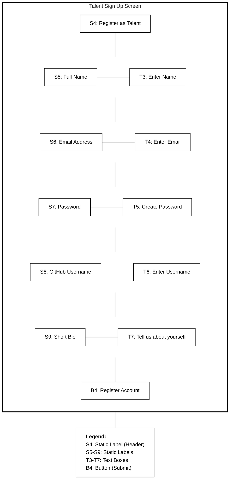
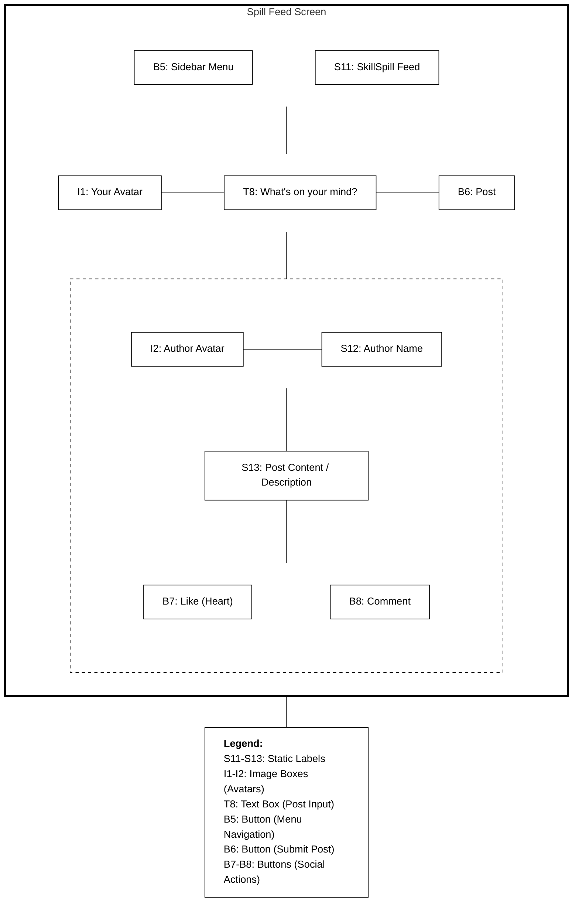

# SkillSpill Wireframe Storyboards

This document contains low-fidelity UI Storyboard mockups specifically tailored to the **SkillSpill Codebase**. 

These diagrams replicate a wireframe sketching style (using **S** for Static Labels, **T** for Text Boxes, **B** for Buttons, and **I** for Images), exactly matching standard UI/UX wireframing conventions. Each screen is accompanied by a legend detailing the elements.

## 1. Log In Screen

## 2. Talent Sign Up Screen (`/signup/talent`)

## 3. Spill Feed Screen (`/feed`)

