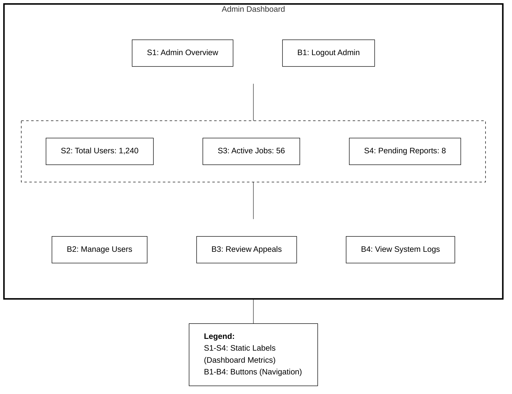
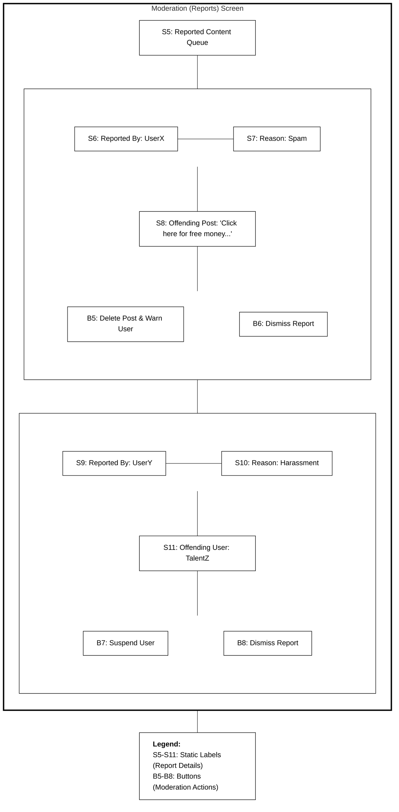
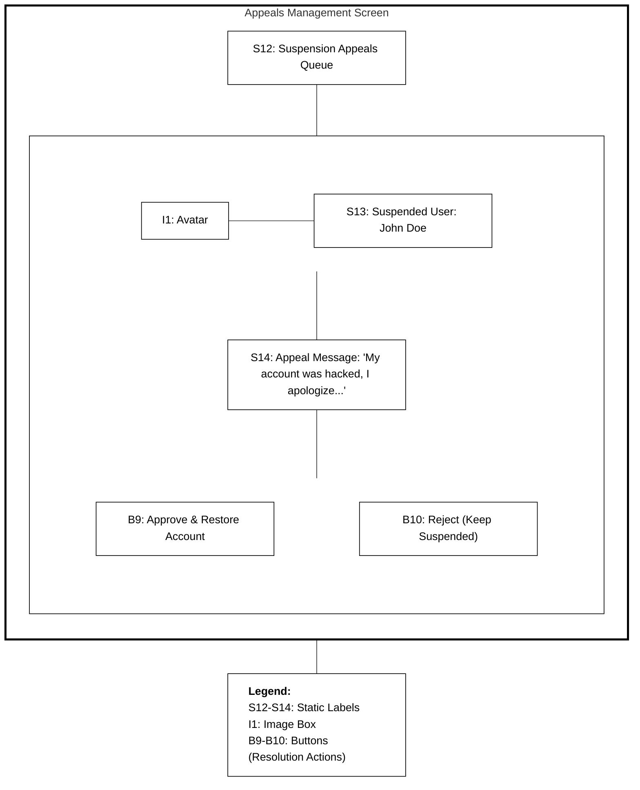

# Admin Module - Wireframe Storyboards

This document contains the low-fidelity UI wireframes for the **Admin** screens within the SkillSpill application.

## 1. Admin Dashboard (`/admin/dashboard`)

## 2. Content Moderation (Reports) Screen (`/admin/reports`)

## 3. Appeals Management Screen (`/admin/appeals`)

