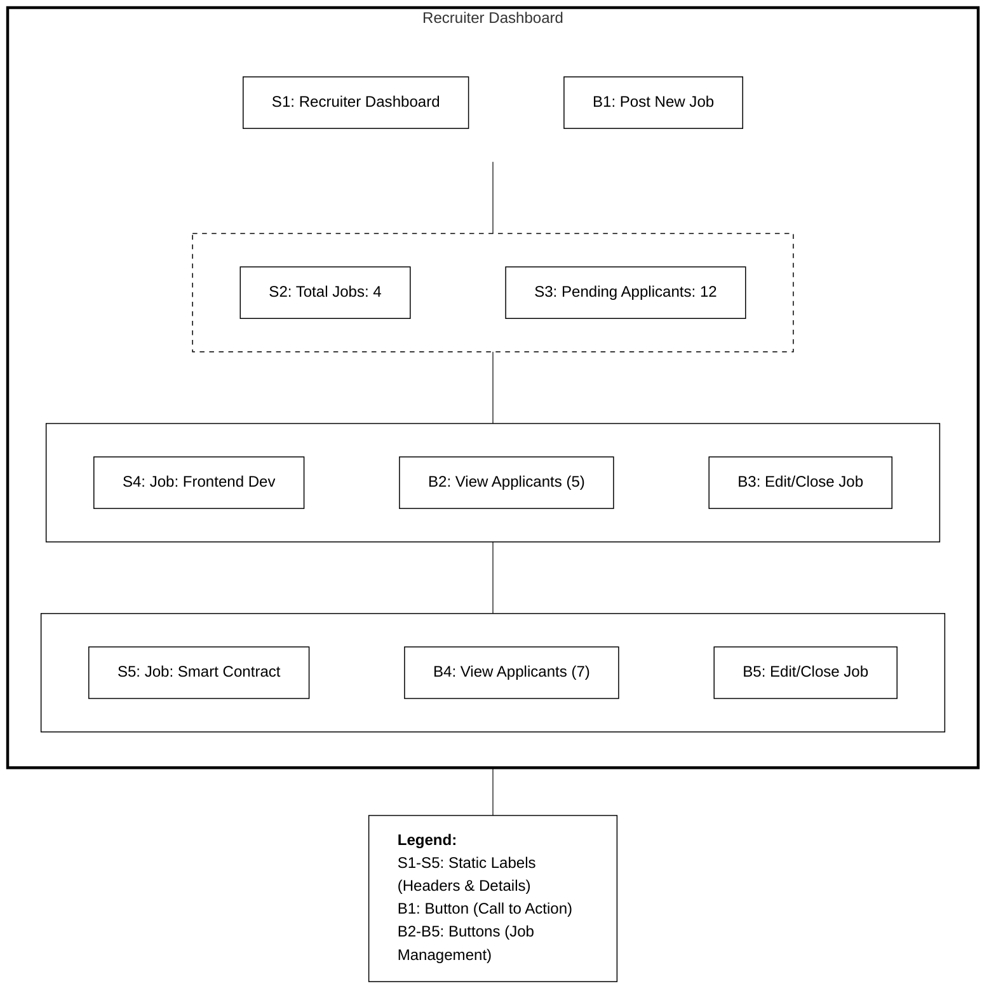
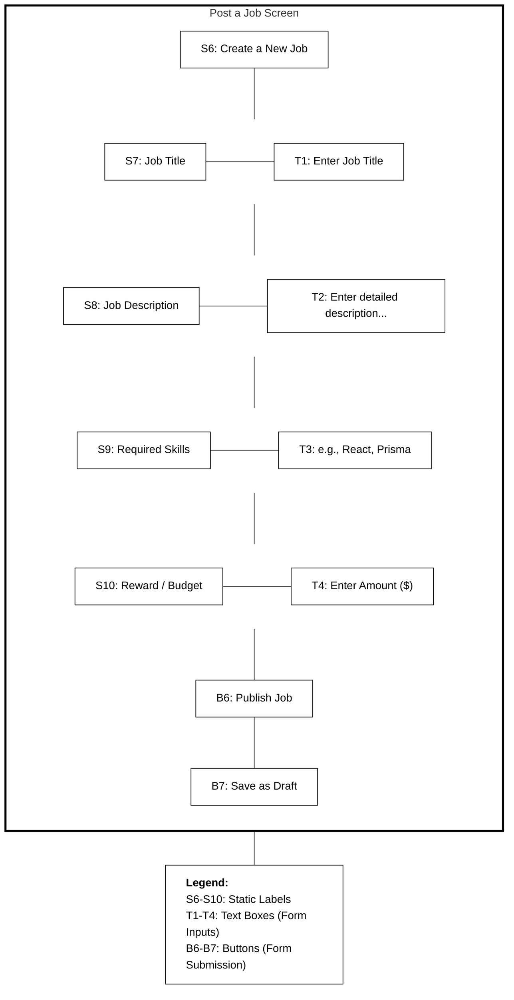
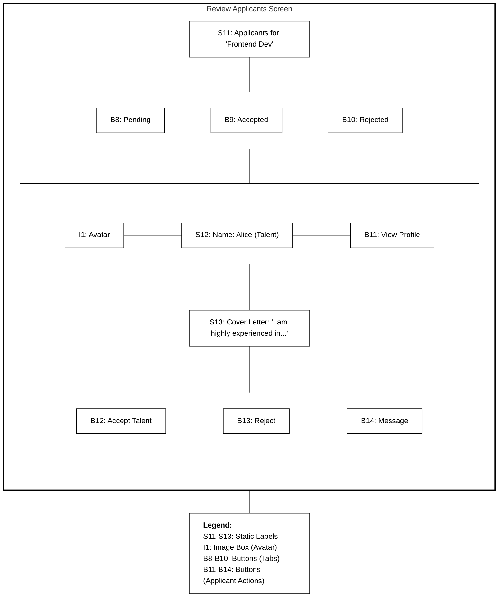
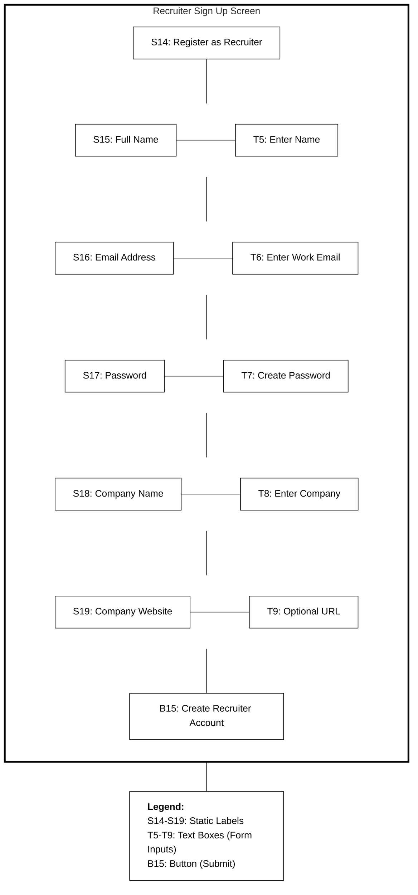

# Recruiter Module - Wireframe Storyboards

This document contains the low-fidelity UI wireframes for the **Recruiter** screens within the SkillSpill application.

## 1. Recruiter Dashboard (`/recruiter/dashboard`)

## 2. Post a Job Screen (`/recruiter/jobs/create`)

## 3. Review Applicants Screen (`/recruiter/applications`)

## 4. Recruiter Sign Up Screen (`/signup/recruiter`)

