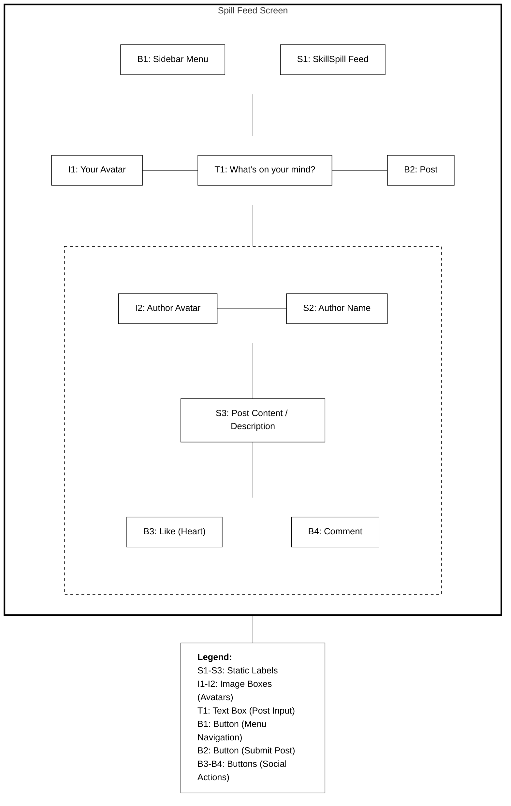
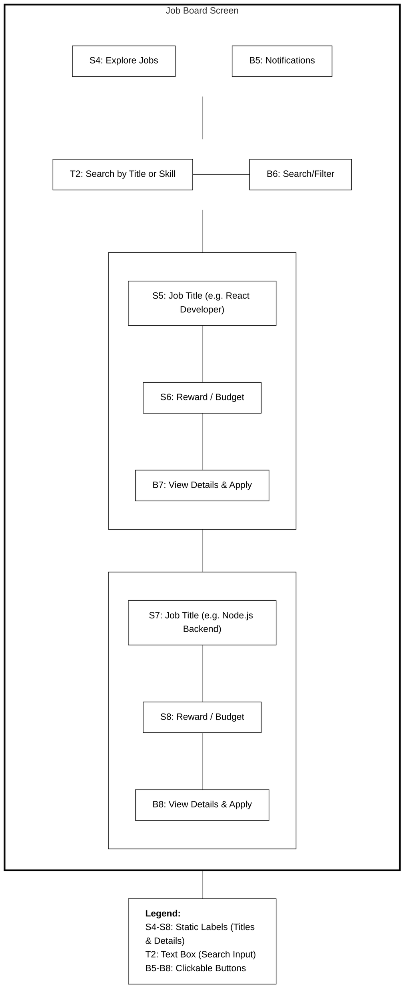
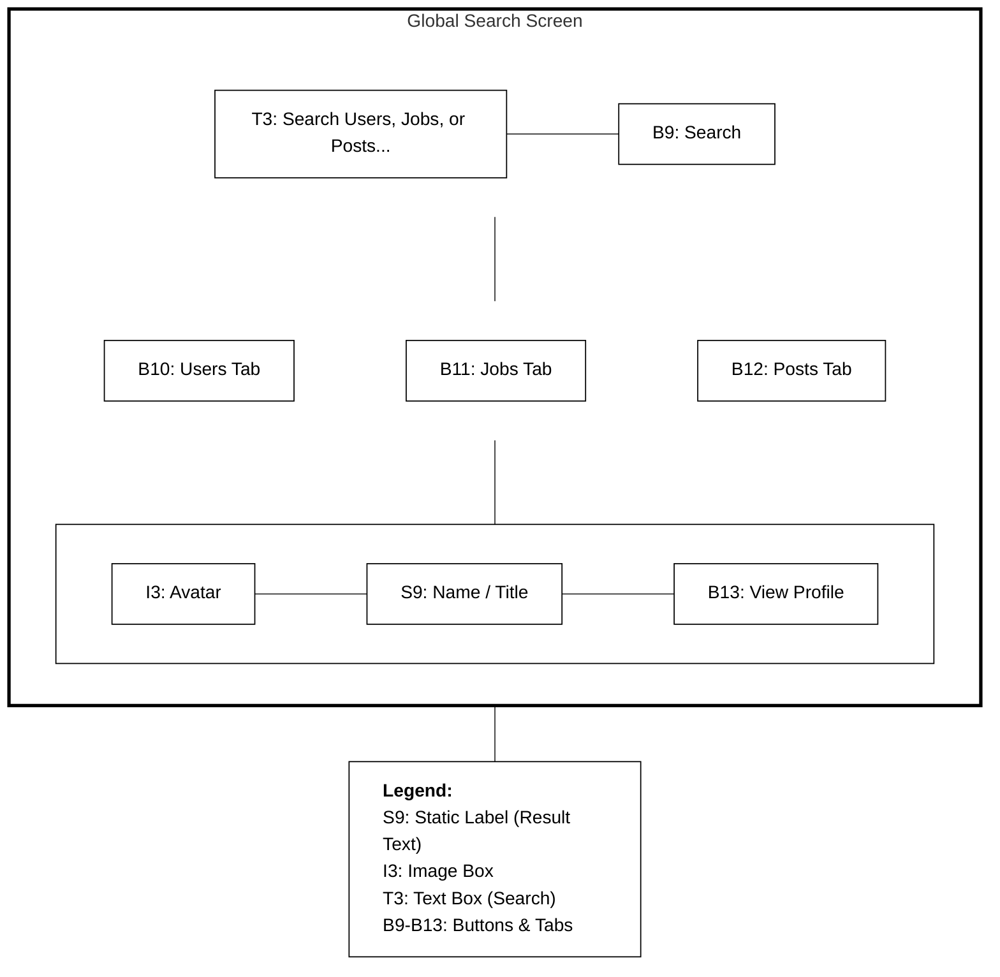
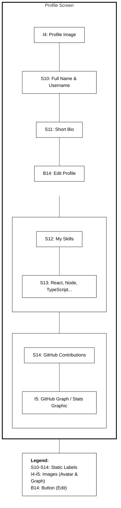
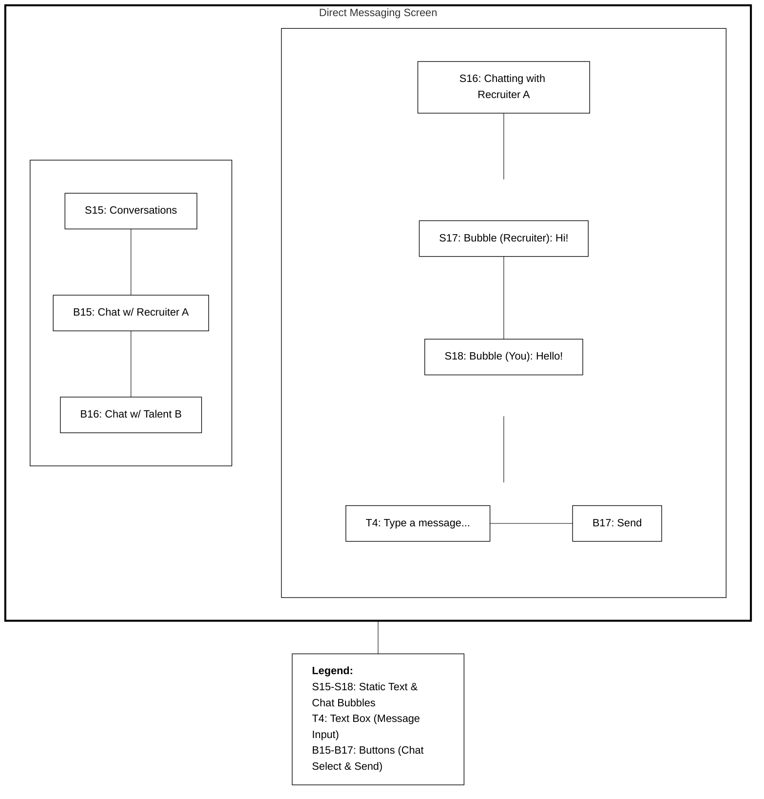

# Talent Module - Wireframe Storyboards

This document contains the low-fidelity UI wireframes for the **Talent** screens within the SkillSpill application.

## 1. Spill Feed Screen (`/feed`)

## 2. Job Board Screen (`/talent/jobs`)

## 3. Search Screen (`/search`)

## 4. User Profile Screen (`/talent/profile`)

## 5. Messaging Screen (`/messages`)

