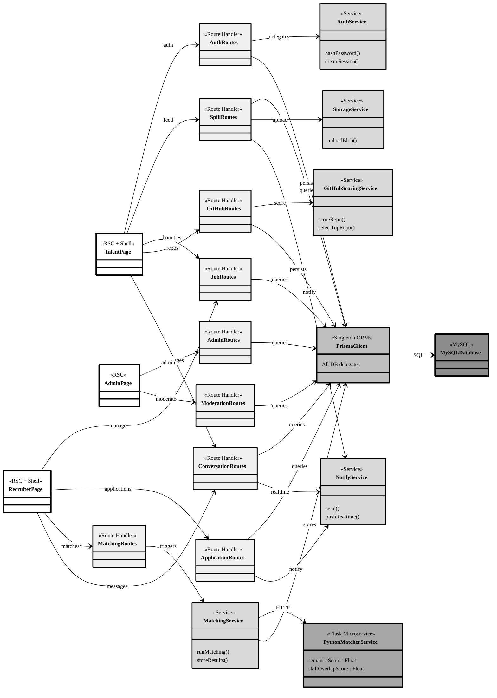

# SkillSpill Design Class Diagram

Verified against the codebase. Optimised for **A4 landscape** printing.

> **Print tip**: Paste into [mermaid.live](https://mermaid.live) → **File → Print → Landscape → A4 → Scale to fit**.

## Diagram (Mermaid)

---

## Layer Legend

| Fill | Layer |
|---|---|
| White `#ffffff` | UI (Next.js Pages) |
| Light grey `#f0f0f0` | API Route Handlers |
| Medium grey `#d9d9d9` | Service Layer |
| Dark grey `#a6a6a6` | External Microservice (Flask) |
| Mid-dark `#bfbfbf` | Data Access (Prisma ORM) |
| Darkest `#8c8c8c` | MySQL Database |

> **Border key**: **3px** = critical/central · **2px** = primary

---

## Layer Descriptions

1. **UI**: Server-rendered pages with embedded client shells for interactivity.
2. **API Routes** (`/app/api/`): REST boundary — one class per route group.
3. **Services** (`/lib/`): Auth, GitHub scoring pipeline, semantic matching, notifications, and blob storage.
4. **Microservice** (`matching-service/`): Dockerised Python Flask — computes semantic + skill-overlap scores.
5. **Data Access**: Single `PrismaClient` singleton querying MySQL via Prisma ORM.
