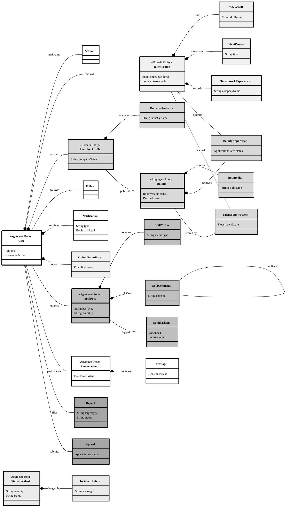

# SkillSpill Domain Model Diagram

High-level domain model verified against the Prisma schema. Optimised for **A4 landscape** printing.

> **Print tip**: Paste into [mermaid.live](https://mermaid.live) → **Print → Landscape → A4 → Scale to fit**.

## Diagram (Mermaid)

---

## Legend

| Fill | Domain |
|---|---|
| White `#ffffff` | Identity — User, Session, Follow, Notification |
| Light grey `#f0f0f0` | Talent — TalentProfile, TalentSkill, TalentProject, WorkExperience, GithubRepo |
| Medium grey `#d9d9d9` | Recruiter & Bounty — RecruiterProfile, Industry, Bounty, BountySkill, Application, Match |
| Mid grey `#bfbfbf` | Social — SpillPost, SpillMedia, SpillComment, SpillHashtag |
| White `#ffffff` | Comms — Conversation, Message |
| Dark grey `#a6a6a6` | Moderation — Report, Appeal |
| Near-white `#ebebeb` | System Status — StatusIncident, IncidentUpdate |

> **Border**: **3px** = Aggregate Root · **2px** = Domain Entity · **1px** = Value Object
